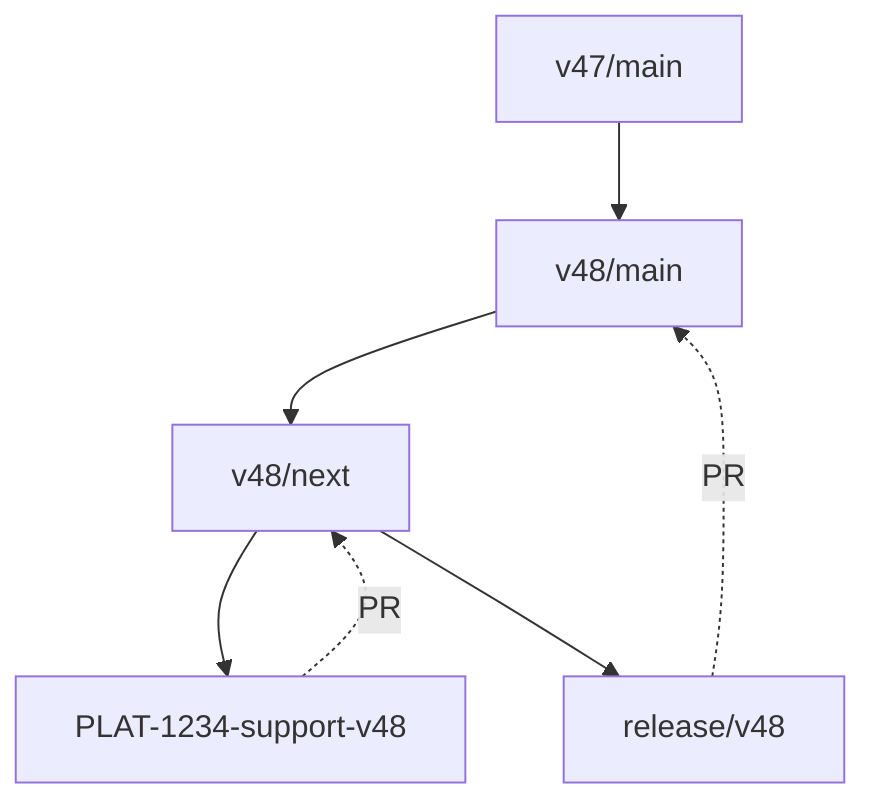

# Releases

## Enhancements and bug fixes

- decide on a new version number, following [semantic versioning](https://semver.org/)
- create a new release branch from `vX/next` with the new version number in the branch name i.e. `git checkout -b release/vX.Y.Z`
- update the version number and date in the changelog
- make a pull request from your release branch to `vX/main` entitled "Release vX.Y.Z"
- get the pull request reviewed – all code changes should have been reviewed already, this should be a review of the integration of all changes to be shipped and the changelog
- consider shipping a [prerelease](#prereleases) to aid testing the release

<!-- Tom -->
<!-- Should we also consider merging or cherry-picking the fix to other affected major version branches? -->

## New Expo SDK release



- create and push a new **main** branch for the new supported Expo version (e.g. `v48/main`) from the latest current branch (e.g. `v47/main`), checking for unreleased changes in the equivalent `next` branch (e.g. `v47/next`)
- create a new **next** branch based on the new **main** branch (e.g. `v48/next`)
- create a feature branch from which the changes to support the new version are to be made (e.g. `PLAT-1234-support-v48`)
- make the required dependency and CLI changes for the latest Expo version (see [Keeping dependencies in sync](#keeping-dependencies-in-sync)) 
- regenerate the e2e test fixture using the `create-expo-app` cli
- update the version number and release date in the changelog
- make a PR from your release branch (e.g. `PLAT-1234-support-v48` to `v48/main`) entitled `Release v48.0.0`
- get the release PR reviewed
- consider shipping a [prerelease](#prereleases) to aid testing the release

Once the release PR has been approved:

- merge the PR

You are now ready to make the release. Releases are done using Docker. You do not need to have the release branch checked out on your local machine to make a release – the container pulls a fresh clone of the repo down from GitHub. Prerequisites:

- You will need to clone the repository and have Docker running on your local machine.
- Ensure you are logged in to npm and that you have access to publish to the following on npm
  - any packages in the `@bugsnag` namespace
  - the `bugsnag-expo-cli` package
- Ensure your `.gitconfig` file in your home directory is configured to contain your name and email address
- Generate a [personal access token](https://github.com/settings/tokens/new) on GitHub and store it somewhere secure

Build the release container:

`docker-compose build release`

Then make the release:

```
GITHUB_USER=<your github username> \
GITHUB_ACCESS_TOKEN=<generate a personal access token> \
RELEASE_BRANCH=<the branch to publish a new release from> \
VERSION=patch \
  docker-compose run release
```

This process is interactive and will require you to confirm that you want to publish the changed packages. It will also prompt for 2FA.

Browser bundles are automatically uploaded to the CDN if they have changed.

<small>Note: if a prerelease was made, to graduate it into a normal release you will want to use `patch` as the version.</small>

Finally:

- create a release on GitHub https://github.com/bugsnag/bugsnag-expo/releases/new
- use the tag vX.Y.Z as the name of the release
- copy the release notes from `CHANGELOG.md`
- publish the release
- update and push `vX/next`:
    ```sh
    git checkout v48/next
    git merge v48/master
    git push
    ```

### Prereleases

If you are starting a new prerelease, use one of the following values for the `VERSION` variable in the release command:

```
VERSION=[premajor | preminor | prepatch]
```

For subsequent iterations on that release, use:

```
VERSION=prerelease
```

For example:

```
GITHUB_USER=<your github username> \
GITHUB_ACCESS_TOKEN=<generate a personal access token> \
RELEASE_BRANCH=<the branch to publish a new release from> \
VERSION=preminor \
  docker-compose run release
```

Prereleases will automatically be published to npm with the dist tag `next`.

The dist tag ensures that prereleases are not installed by unsuspecting users who do not specify a version – npm automatically adds the `latest` tag to a published module unless one is specified.
